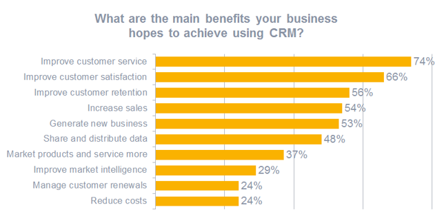
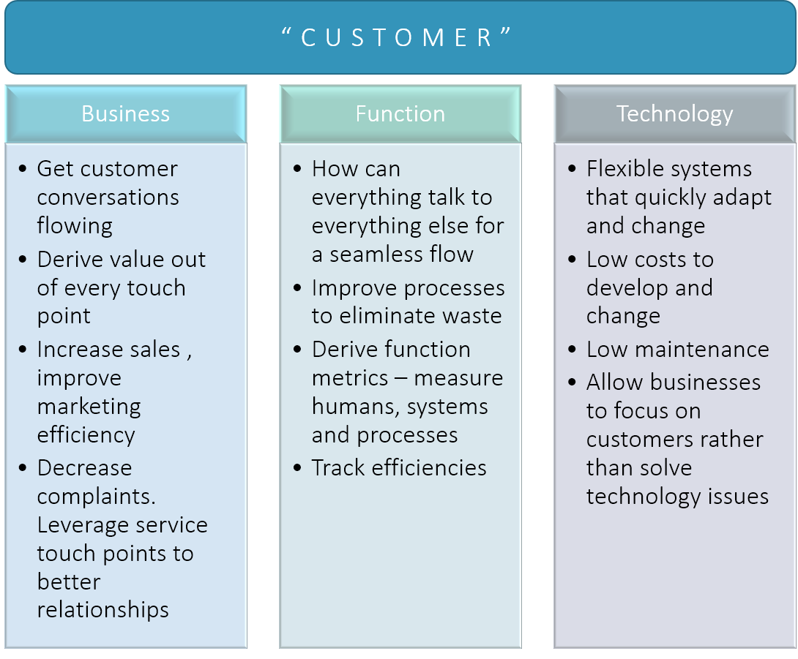
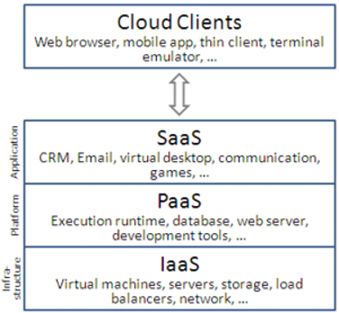
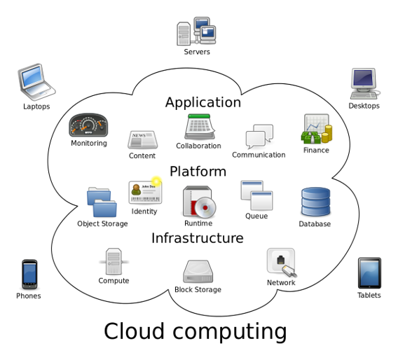
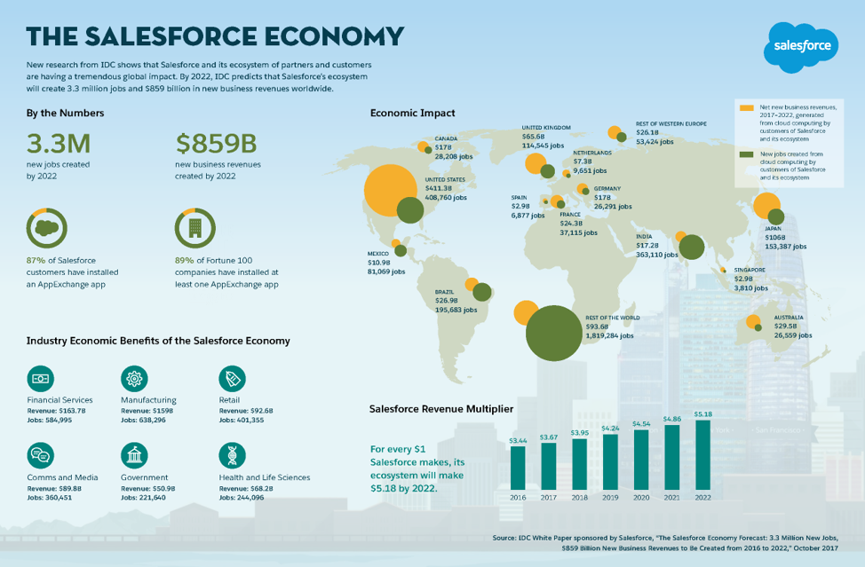
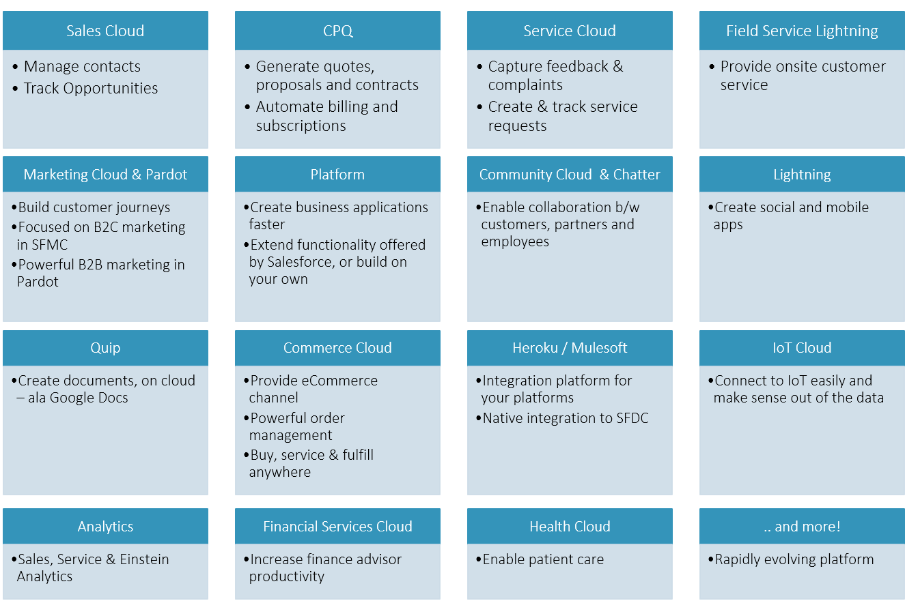

# Introduction

Hello, hello, hello.

Have you gone through the [structure of the admin certification course](/admin-guide/structure)? Do you understand the [different Salesforce career options](/why-learn-salesforce/salesforce-careers)? Ok then, get started on your Salesforce admin journey from here!

## What this course / guide is about?

Well, we are big fans of practical learning. We are also bigger fans of having an objective in sight. Hence.. this course.

With this guide / course structure, you get -

1. Rapid learning to prepare for potential Salesforce Administrator certification (ADM201)
1. Equip yourself with the knowledge required by administrators. All the tools that you require to meet market expectations from an admin
1. Practical guide to understand Salesforce from scratch
1. Real-world problems in workshops and case studies to apply your knowledge

But, why tag learning to "certification" did we hear you ask?

1. We are more inclined to have a structure for our learning process
1. Salesforce world is vast and growing. Preparing for certification will impart adequate knowledge about most of the significant topics that all admins should know
1. With this guide + some experience, you should be confident to attend Salesforce ADM201 exam. Certifications provide credibility in any market

To maximise benefits from the guide -

1. Go through the guide from the beginning (you are at the starting point - so congratulations)
1. Practice tasks from lessons and applied learning workshops
1. Make notes from the guide and from your tasks
1. Gather knowledge through Trailhead and learn by doing

## What is CRM?

We hope you have gone through the [why learn salesforce](/why-learn-salesforce/) section? That chapter should provide you _some_ information about what Salesforce can do.

Salesforce started as a customer relationship management ("CRM") application.

Imagine you are an individual or company peddling your goods or services to dozens of customers. Customers pay you money and get the goods - all simple and well.

On one bright day, you decide to increase you business and include more goods, or deliver services to the customers' location.

You may also want to sell services to people that have bought your products in the past. You even want to wish them on their birthdays .. because, what company doesn't?

All these tasks require you to -

- track customer information
- capture transaction information and set up a seamless process to deliver goods and services
- track customer issues and provide lasting solutions
- identify potential customers from the people who were fortunate to have had previous experience with your business

And.. you have to track all these in a way that will not make your employees insane. You may also want to provide incentives for the good sales/service reps.

CRM includes all the above and a 'CRM system' is the underlying technology on which CRM can happen. CRM encompasses managing information and processes that have customer touch-points.

But, with increasing focus on customers and the ability to apply technology more efficiently, companies put customers at the center of _all_ transactions. From a technology stand-point, this may mean more efficient integrations between CRM and other systems, or better still, make CRM systems the only or core system of all transactions.

Salesforce and other CRM systems increasingly plays a crucial role as the modern enterprise system. They are not just simple sales/ service applications to record transactions, and to 'talk to backend' to get the job done (the 'old paradigm'), but a lot of -

1. Enable superior customer experience across different channels of communication
1. Know your customer and their buying, servicing habits
1. Recognise your high value customers
1. Provide ability to align your sales, service and marketing teams to customer-focused processes and work seamlessly
1. Track efficiencies and opportunities for improvement, and in turn drive agility
1. Enable companies to summarise what they have done across time and drill-down to details when needed

All (most?) of us love a great experience when talking to a company to buy a product or get a service. At the same time, companies love to get customers to come back for more, and spread a good word about their products or services.

As a direct result of the need - the market for CRM keeps growing year on year. It is expected to be a \$80 Billion market by 2025 according to "leading analysts".

If we can be coarse-grained about what this means to you -

> More investment = More things to do in the field = More jobs

## The 'System' Part of CRM

Despite all the hoopla surrounding CRM technologies - you do recognise that Salesforce and other 'systems' provide the tools and practices to get stuff done. Every organisation is unique and will decide on how to use those tools better to drive their objectives and actions.

CRM systems started as monolithic systems that focused on a single job and directed at internal groups.

- Implementation was expensive and time consuming
- Hard to support quick changes
- CRM projects often failed to realise stated objectives
- Complex technology needs with multiple integrations, back-and-forth data movement, and inconsistent processes across systems

On the other hand, modern CRM systems are cloud-based, modular, support a "plug-and-play" approach, and take the technology problem away from organisations.

The objective is for organisations focus on their products / services and on processes to deliver customer excellence - not on maintaining technology systems and infrastructure, and certainly not on worrying about impact of technology to change quickly and adapt to changing business needs.

Today, thanks to an all-pervasive internet , and to sophisticated user experiences that can be enabled in a simple browser - it is all but natural that modern CRM systems have moved to the cloud.

## Cloud Computing

Wikipedia describes cloud computing as -

> Cloud computing is the on-demand availability of computer system resources, especially data storage and computing power, without direct active management by the user.

The reliability of the Internet and the direct effect of shifting more of business on Internet meant that-

1. Organisations can also move components (or the entire) applications to be part of the same Internet
1. Look at avenues for achieving better efficiencies (better computing, lower costs, serve customers faster, etc.)

In order to meet these considerations head on, companies may then open up data centers and maintain their servers as well as applications everywhere on the planet. This will -

1. Force the organisations to develop expertise on creating/maintaining infrastructure (buildings, servers, miles of cables, electricity backups, cooling solutions and so on) in addition to the actual computing hardware
1. Collaborate with tens of hardware companies to maintain the computing infrastructure over months and years
1. Deal with regulatory needs for data centers in each location
1. Invest in all the expenses upfront and wait for years to get to profitabilitu

Or, they could simply move to infrastructure maintained by a third party.

Both of the above options signify that the company moved their computing resources to the cloud.

With cloud computing, companies can -

1. Have their own dedicated setup of connected server infrastructure - maintained by the said companies themselves or by third party - private cloud
1. Rely on third parties who specialise in providing computing resources , which may also be shared with other companies and individuals - public cloud
1. Chase the never-achievable goal of having the right mix of both - hybrid cloud

### Flavours of Cloud Computing

Now that we have some commitment to move to cloud, we may go more granular on the degree of movement.

There are different levels of enabling technologies on the cloud.

  _src: Wikipedia_

Further, when we move the applications to cloud, there can be various applications and application components that may move or stay back within the company IT realm.

For e.g. -

1. Identity management - authentication, authorisation, and more.
1. Financial applications - Billing
1. Enterprise resource planning - product management, order management
1. Content management systems
1. Collaboration
1. Associated backend infrastructure including database systems, enterprise queuing systems and monitoring systems

  _src: Wikipedia_

You can see on the second pass that this also sits firmly within the PaaS, SaaS categorisation that we saw moments ago.

### Features

A few of the features that are associated with cloud computing today are listed below -

- Accessible from anywhere — Move your applications nearer to users and make the accessible from anywhere (and dare we say, any device).
- Scalable - tune up your infrastructure and computing resources up or down - FAST. Make additional computing available to handle peak loads and reduce resources to contain cost post the peak event. The best part - all this is done at the click of a button
- Flexible — Deploy more than one type of cloud computing resource and mix-and-match them to suit your needs and budget. Do not be afraid to change - it is quick and painless.
- Low maintenance

  - Many of the problems with your own data centers - e.g. electricity, building and associated infrastructure are someone else's problem (and that someone else deals with only that)
  - Maintenance of complex software and the various layers, along with the associated hardware may shift in part or whole to specialised third parties

- Cost-effective — Pay for what you use. Pay only at the time of using the resource. No more upfront investment that force companies to wait for months or years for a positive ROI

## Where does Salesforce fit in?

Salesforce.com, or SFDC as it is dearly known, stands out as a leader in numerous enterprise functions.

Salesforce applications represent the cloud computing applications that provide a combination of sophisticated, easy-to-configure and simple to maintain applications on public cloud.

Salesforce checks two of the above boxes -

- SaaS: you can use the software for CRM (& more) and configure/customise to suite your need
- PaaS: build new stuff, your own apps, and add significant enhancements to what Salesforce provides out-of-the-box

> [See here for an overview of CRM leaders and how they fare](https://dynamics.microsoft.com/en-us/analyst-awards/) as per market analysts.
>  (PS: Yes, this is using a 'competitor' website to make a point, but we equally love Microsoft )

Salesforce provides -

1. horizontal functions - functions like sales, service, marketing etc. that exist across industries. Salesforce Sales Cloud, Service Cloud are examples of products in the salesforce ecosystem that provide horizontal functions
1. vertical functions - support processes tailored to a particular 'vertical' or industry. This includes products like Salesforce Health Cloud, Financial Cloud and CRM for numerous other industries supported by different apps on AppExchange

The unparalleled functionality enablers, ease of implementation, and the 'cloud advantage' have propelled salesforce to the forefront, and has resulted in more & more organisations adopting the product. The increased adoption has led to more salesforce technology partners focusing on making it easier and quicker to implement products and services. All the positive feedback loop leads to a strong Salesforce-driven economy.

  _src:salesforce.com_

Remember that we mentioned that Salesforce goes beyond just a traditional CRM? That fact is more evident in the above chart.

## Salesforce Platform

Salesforce provides more than few functions and has an ever-expanding portfolio to solve many business problems.

An outline of popular products is below -

As part of this guide, we will be focusing more on the core platform, Sales Cloud, Service Cloud, Lightning (which is the UI component) and Community Cloud products. Henceforth, when we refer something as SFDC - we just have these products in mind.

## Salesforce Editions

Salesforce.com comes to you in different applications and flavours that provides different functions and customisation options.

The applications are grouped under the core functions like Sales Cloud, Service Cloud, etc. like we saw in the previous paragraph. The different flavours of a product that provide varying levels of complexity are called "editions".

As with anything in nature, the more you want -> the more you pay.

Popular editions are below -

| Professional                                                                                                      | Enterprise                                                                                                                          | Unlimited                                                |
| ----------------------------------------------------------------------------------------------------------------- | ----------------------------------------------------------------------------------------------------------------------------------- | -------------------------------------------------------- |
| Most CRM functions for any sized teams. All major entities and processes – e.g. Accounts, Contacts, Opportunities | Custom App Development, Workflow and approval automation, Console applications, Integration via webservice API, Salesforce Identity | Unlimited power,Additional data storage, Powerful addons |

See [Sales Cloud pricing page](https://www.salesforce.com/in/editions-pricing/sales-cloud/) for an example of how this works.

## Signing up for Salesforce

Individuals or companies can sign up to a free developer edition. This allows a highly limited edition to try out salesforce functions.

- Go to [https://developer.salesforce.com/signup](https://developer.salesforce.com/signup)
- Enter some basic details and sign up. Note that your login name must be of the email address format. You may have different login names for the same email address, and can have different developer edition instances (we can be weird in a way)
- And tada.. your own Salesforce instance is ready

You can follow instructions in email to login, which amounts to -

1. Go to [https://login.salesforce.com](https://login.salesforce.com)
1. Enter your email id and password
1. Click on 'Log In'

Developer editions have limited users but a whole lot of functionalities enabled. Play around, evaluate, and customise your app.

Customers can also sign up for "30-day trial" version of Salesforce. Just signup on the [home page of salesforce.com](https://www.salesforce.com/) - click on 'Try for Free' or something similar.

Trial version will allow them to take Salesforce for a trial while they make their purchasing decisions. Any changes that they do in Trial editions get carried forward to their "real" production environment. (Trial environment is a production environment and may also supply with non-production environments to give you the full experience).

Once you are a full-blown customer of salesforce -

1. You get a production environment where you develop your "real" application for your users to use
1. Depending on your edition, you may get development/test environments that you can spin up on demand. You may do changes here and test them, before deploying those changes to production

## Workshop

The 'workshop' section in a chapter/lesson provides a set of activities that the students need to do after the theory and practice classes for individual lessons in the Salesforce Admin course.

The intent is to provide -

1. get students to "do stuff" at the end of each chapter
1. practical, real-world problems: Outline business scenarios and specific problem statements that require students to apply their salesforce.com learning (well, to 'some' extent)
1. solution details: Provide high level design elements to solve afore-said problems.

**Instructions**

1. Discuss problems/solutions with your instructor(s) in case of any queries
2. Complete the activities before bringing in your unique perspectives and/or solutions to the problem

**Outcome**

The problems provided are expected to incrementally build the complexity of your application as you progress. You will be a better admin, IT analyst or developer who can analyse a problem, think through possible solutions, and identify & implement changes on salesforce.com platform.

Introductions done, let's see the tasks at hand for this chapter.

| No. | Type    | Description                      | Time (hrs) |
| --- | ------- | -------------------------------- | ---------- |
| 1   | Present | Comparison – SaaS, PaaS and IaaS | 0.5        |
| 2   | Present | SFDC Alternatives                | 0.5        |
| 3   | Learn   | Soft-skills: Trailhead           | 3          |
| 4   | Learn   | Skills: Trailhead                | 2          |

### Comparison – SaaS, PaaS and IaaS

1. Outline at least 5 factors and differences between SaaS, PaaS and IaaS.
2. Present to audience

### SFDC Alternatives

1. Outline at least 3 competitors to Salesforce.com
2. Outline similarities, differences as compared to SFDC
3. Present to audience

### Skills: Trailhead

1. Complete the following
   - [Salesforce Advantage](https://trailhead.salesforce.com/content/learn/trails/salesforce_advantage)

### Soft-skills: Trailhead

1. Complete the following -

   - [SFDC story telling - Trailhead](https://trailhead.salesforce.com/en/content/learn/modules/manage_the_sfdc_storytelling)
   - [Transform business expeditions - Trailhead](https://trailhead.salesforce.com/content/learn/trails/transform-business-sf-expeditions)

## Teaching Aids

Each chapter is accompanied by teaching materials that (hopefully) help you present the course material to students in a structured way. There may not be a 100% match between the lessons/chapters and the presentation materials considering the distinct sources of the teaching aids, but do conform to the underlying structure.

### Presentation

#### 1. Introduction to Admin Certification Course: sf-cog

&nbsp;

<iframe src="https://docs.google.com/presentation/d/e/2PACX-1vSasr6Tba9qMmhTuU_Pq1ek1KXK_MNr07aPutlsmEflC9yXyDRHa66VU082KsL4vA/embed?start=false&loop=false&delayms=60000" frameborder="0" width="800" height="600" allowfullscreen="true" mozallowfullscreen="true" webkitallowfullscreen="true"></iframe>

[More info](/misc/pricing#sf-cog)

## References and Further Study

### Read & Research

- Go over [Cloud Computing history](https://www.salesforce.com/in/cloudcomputing/?d=70130000000YsaZ)
- Study up on alternate CRM platforms on cloud
- Competitors to SFDC - traditional and cloud

### Watch

- [What is CRM - Youtube](https://www.youtube.com/watch?v=biTpNmFXYd0)
- [What is Salesforce - Youtube](https://www.youtube.com/watch?v=di6iwHhrH6s)

### Do

- Sign up for [Trailhead](https://trailhead.salesforce.com). How many courses can you complete in 24 hours?
- Checkout [Trailhead trails](https://trailhead.salesforce.com/en/content/learn/trails/learn_salesforce_with_trailhead)
