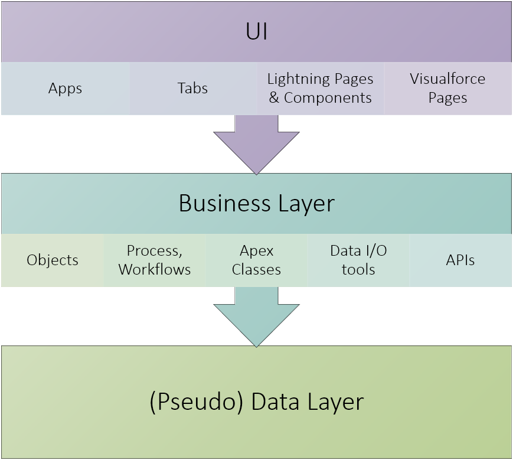
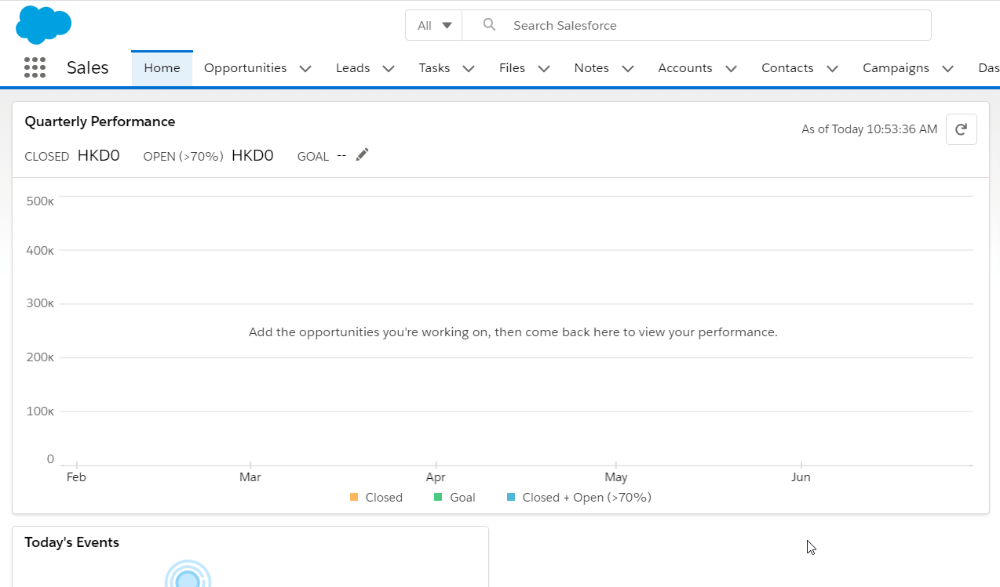

# Platform Fundamentals

At this point, you have gone through what salesforce is. We will see what components make up Salesforce and how it behaves for various types of users and organizations.

## What is Salesforce platform about?

Out of the box, Salesforce provides you with a standard core CRM product, a sales product, service product and so on - the functionality depends on which product or edition you choose. You build applications on top of the product/platform and customise for your need.

And.. by "platform" - we mean the base product that comes with Salesforce. The platform enables you to carry out customisations to tailor the out of the box (OOB) Salesforce product. The customisations can be with or without using code - administrators or developers can change application behaviour for all users.

- Add new fields or entities
- Change validation
- Enable system to automatically send emails when you change opportunity status

The users themselves have some freedom to decide how they use the application. For .e.g they can set default filters on screens, change appearance, change locale etc.

A "product" can be referred to the set of specific functions like sales or service built on top of the Salesforce platform. A product may also be licensed from third parties from AppExchange - for e.g. Veeva product is available on AppExchange and is mainly targeted at Pharma companies.

Companies and people may just refer to the product they have licensed from Salesforce (& third parties) as the platform, and start adding more customisations on top of the product. This is ok for the real world.

## Underlying Components in Salesforce

We will delve a bit more into components that make up Salesforce.

### Layered Architecture

Any application /system will have multiple layers to do its job. You can visualise those layers with the following diagram.

- The User Interface ("UI") layer has apps (a group of tabs), tabs that you can click on to navigate to different pages, and custom-built pages / components of pages that use Lightning or Visualforce
- The business layer supports UI by providing a window to data after applying security rules and data manipulation logic. It also enables data validation rules and business automation
- Data layer can be just imagined as a underlying database that exists somewhere in the background. It is abstracted from us using business layer, which serves as the foundational layer in salesforce

The customisation of a Salesforce app consists of designing and developing an app. This typically consists of two major steps -

**Design top-down**

Start with what users want to see and where do they want to see them, and how do they carry out their tasks. Then design the business layer including business objects, validation rules and automation routines.

**Develop bottom-up**

Start developing the business layer - from business objects before moving on to the UI layer.

If you think the above clear-cut process sounds too good to be true, you will be right. It is representational - any design/development process will iterate amongst all layers.

Let us start looking at individual layers in more detail.

## User Interface Components

Users interact with the application through UI (the name gives away all the suspense).

UI consists of -

- apps: containers of all goodness
- tabs: click on 'em to get to pages
- elements that make up a page
  - input elements like fields (text fields, drop-downs), buttons
  - display elements like labels, image galleries
  - complex elements that are made up of other UI elements and data - like forms, list views, charts, etc.

You can create UI in Salesforce through drag/drop action

### Salesforce Apps

Apps lead you into the wonderful world of salesforce applications. While they are the starting point, you can see that the user interface ("UI") is made up of many, many more elements.

At the same time, UI is all but a layer that relies on other layers to fetch data, do validations etc.

Salesforce apps can be seen as a bunch of screens that provides a nice boxed layout for related functionality.

The app consists of -

1. One or more tabs
1. A logo
1. Little else

An "app" is just a starting point of your amazing application. Salesforce gives you apps based on what you purchased and you can create your own apps.

You access the app through the navigation bar.

While the product you licensed determine which app you get - you could always create more apps on existing functionality.

For e.g. if you have Sales Cloud, nothing will prevent you from having Sales - Retail, Sales - Wholesale apps targeting two different groups and having two distinct set of tabs.

### Tabs

Tabs expose a business entity & function on UI. You click on a tab to reach pages that consist of UI elements like charts, list views or detail views.

For example - see the above image. You see a bunch of tabs for cases, accounts, reports etc. when you select an app.

Tabs are directly mapped to business object in the business layer - however, there can be more than one tab on a single business object. Remember that we said "typically" - there are exceptions abound to this non-rule. For e.g. home / report tabs can have dashboards that are based on unrelated components.

Any page reached by clicking through a tab is typically based on the root business object that the tab is based on or a related entity. This makes sense since we (pretend to ) learn our organisational skills from day 0.

#### Chatter

### How to use Salesforce?

### Editions

## Users

### Security

#### Roles

#### Profiles

#### Permissions

#### Permission Sets

### Licenses

## Salesforce AppExchange

## Data Security

## Workshop

Complete the following tasks.

| No. | Type    | Description                                      | Time (hrs) |
| --- | ------- | ------------------------------------------------ | ---------- |
| 1   | Do      | Install apps from AppExchange                    | 0.5        |
| 2   | Present | Differences between trial, test drive trialforce | 0.5        |
| 3   | Do      | App licenses                                     | 0.5        |
| 4   | Do      | Security                                         | 0.5        |
| 5   | Do      | Create role hierarchy and explore                | 0.5        |
| 6   | Do      | Create profile/permission sets and explore       | 1          |
| 7   | Do      | Enable Chatter                                   | 0          |

### Install Apps

Install following apps in your dev org.

1. [Volunteers for Salesforce](https://appexchange.salesforce.com/appxListingDetail?listingId=a0N30000003JBggEAG)
2. [Salesforce Adoption Dashboards](https://appexchange.salesforce.com/appxListingDetail?listingId=a0N30000004gHhLEAU)
3. [Conga composer](https://appexchange.salesforce.com/appxListingDetail?listingId=a0N300000016b7FEAQ)
4. [Survey Monkey](https://appexchange.salesforce.com/appxListingDetail?listingId=a0N3A00000EOBliUAH)
5. Make note of where can you see the installed packages in the application
6. Go to the package. Select any `App` created by one of the packages. Copy the name.
7. Create a new `App` by the same name. Will Salesforce allow you to create such an app? Why?

### Differences between trial, test drive trialforce

1. List at least 3 differences between how AppExchange enables trial, test-drive and trialforce apps.
2. Imagine you will create an app called “KEvents” to enable users to manage events like corporate events, teaching and education, professional training for medical reps. You will put a cost of \$500 / org. Do you enable trial for the app? If yes, how? Outline why you chose an option
3. You will release the second version of “KEvents” with map integration, travel ticket booking for attendees including availability checks, hotel booking for attendees incl. best rate checks and a cool function to showcase “sights to visit” in the event city. You will increase the cost to \$5000 / org. Will this impact your earlier decision? If yes, how and why?

### App licenses

1. Create user `sr1`, and do not assign any license. Login as SR1. Which apps does the user see – list them? Why does she see any views/ data if no license is assigned?
2. Assign license `Work.com only` to `sr1`. Will she now be able to see the app? Why / why not?
3. Where can you find out how many licenses are available/consumed in your Salesforce app?

### Security

1. Change login time range for `sr1` to 08:00 AM EST to 6:00 PM EST. Save record
2. Logout of `sr1` session if you have logged in. Can you login during IST day time now?
3. Remove login time restrictions
4. Add password string restrictions to contain at least one capital letter, two special characters. Test functionality by trying to reset password for `sr1`

### Create role hierarchy and explore

1. Create the following role hierarchy
   
1. Create user `sr1`, and assign role as `Sales Rep 1`
1. Create user `sm1` and assign role as `Area Sales Manager 1`
1. Login as `sr1`. Create 5 accounts, create 5 tasks
1. Login as `sm1`. Is the user able to see accounts and tasks? List why?

### Create profiles/permission sets and explore

1. Create the following profiles
   - UC Admin – clone from System Administrator
   - UC Sales Rep – clone from Standard User
2. What gets copied over from the roles? List down 3 reasons to clone profiles rather than creating them afresh.
3. Create permission set - `UC Sales Rep Order Super Editor`.
   - Provide “Edit Activated Orders” app permission
   - Provide “Edit” object permission for Orders object
   - Remove ‘Export Reports’ system permission
4. Create following profile – UC Sales Rep No Order
   - Remove order edit object permission
5. Assign the profile and permission set to `sr1`. Is the user able to edit activated order?
6. Create profile – `UC Sales Mgr No Sales`
   - Remove view/edit permissions on sales app
7. Assign `UC Sales Mgr No Sales` to `sm1`. Logout and log back in. Will manager still be able to see sales app?
8. Create a permission set called `UC Sale Sale`. Add permission set to `sm1`. Logout and log back in. Will `sm1` see `Sales` app now? Why?

### Enable Chatter

1. Enable Chatter feed in your org.
2. Follow 2 of your favourite accounts. List down how account updates are mentioned in Chatter. How will you get notified?

## Teaching Aids

### Presentation

#### 1. Platform Fundamentals: sf-cog

&nbsp;

  <iframe src="https://docs.google.com/presentation/d/e/2PACX-1vSNcT_AgPRtmWBlz2Xe0tpX8Pb7hpENWGWlgVwmAJIOJ40G2AI71i7zi_VZ_S6WOg/embed?start=false&loop=false&delayms=60000" frameborder="0" width="800" height="600" allowfullscreen="true" mozallowfullscreen="true" webkitallowfullscreen="true"></iframe>

[More info](/misc/pricing#sf-cog)
