# Configure Custom Functionality

To restate what we cover here -

1. Configure = clicks
1. Customise = use code

This is just for clarity and simplicity of the language used here. More than few organisations use the terms interchangeably and the terms mean more or less the same. So 'configure custom functions' is a pun on itself, and on us.

In this section, we will start seeing a bit of how we can add functionality to salesforce using clicks. By now you should have an org to begin your click-click adventure.

In Salesforce, adding new functions can be -

1. Adding new entities. For e.g. I want a `Health History` for Contacts that is not available out of the box
1. Adding new screens for people to work on (called UI = user interface)
1. Adding new validation rules. For e.g. contacts must have a middle name (so make contact middle name mandatory)
1. Adding automation flows. For e.g. whenever I create a contact, also create an activity to send them a welcome kit

While each of (2) - (4) can be done on entities provided by Salesforce, we often find the need to support businesses by adding even more entities to the mix. All these entities are "Objects" in Salesforce. We can modify existing objects are create new.

## Objects

As we have seen earlier - objects represent entities.

Objects can be roughly thought of as -

- 'model' layer of a MVC pattern
- ..and akin to 'database tables' of an app

If that does not make sense to you, just ignore them - it was the developer in us doing the talking.

Objects can also be imagined to be a container of a specific type of data. For e.g. a contact is an object in salesforce, so are opportunities, orders, tasks etc.

Objects by themselves do not store data, but are the only window to access the said data. User interfaces are built on top of the fields, validation, and automation added to objects. Once you use objects to store data, that is persisted to a data store - where and how is that persisted is not super relevant to us as salesforce administrators and developers. But, what is relevant is that Salesforce provides performant, customisable storage that is consistent, scalable to a high number of users, and subject to validation and automation rules of your individual company.

Salesforce provides a set of objects out of the box and those are known as 'standard objects'. You (or package vendors) create 'custom objects'.

### Standard Objects

Salesforce provided objects are more than enough for many small to medium businesses out there :). As soon as you buy Salesforce or create a dev edition, they are very much in your face. Just navigate to 'Sales' or 'Service' apps through the 'app' icon if you don't see anything.

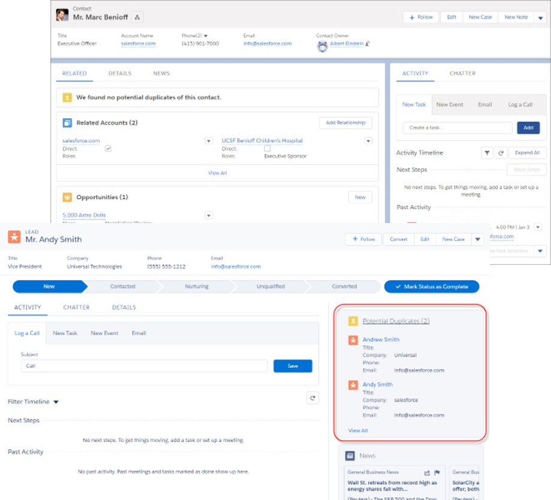

A few examples -

1. Contacts, Accounts
1. Activities, Opportunities, Leads, Cases
1. Notes, Files

Salesforce smartly bundles all the things that you could do against objects under, well, "Object Manager". Navigate to `Setup` | `Object Manager` tab to see examples.

Keep in mind while thinking about these entities -

1. It is easier to extend current entities than to create new ones. For e.g. you can create a new field called `Super Strengths` in `Contact` rather than creating a new entity called `Super Strengths` with a field called `Strength`. Both options have their usage, but you must know the simpler option
1. Keep scalability in mind. Don't over-engineer by creating entities that you may never need.
1. Standard objects have their limitations on what you could customise (e.g. defining relationships that involve a Salesforce object)
1. There are limits on the number of new entities you can add

To see objects in your org, login to your salesforce.com instance.

Go to **Set up** [ click on `cog` icon at the top right & select `Setup`] > **Object Manager** [click on `Object Manager` tab].

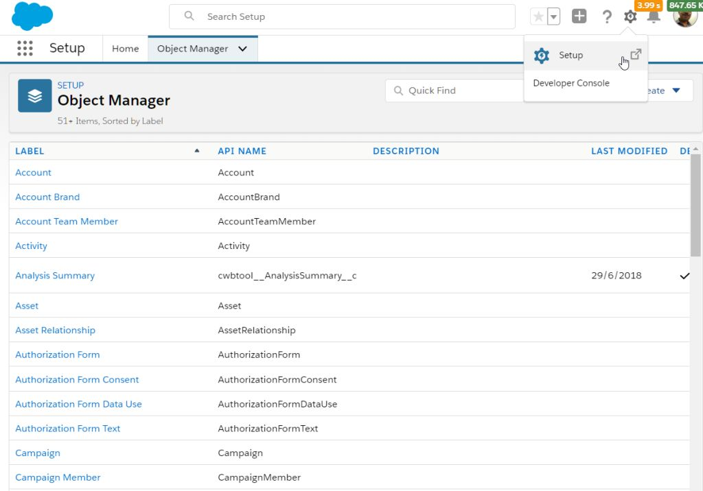

### Custom Objects

When out of box objects are simply not enough, you create custom objects which are local to your org.

For e.g., a retail company can create -

1. Trade Promotions
1. Planograms (that show images of product placements in shelves)

Custom objects may also be created through the packages installed in the org. All custom objects have a `__c` suffix against their name - whether created by you or the package.

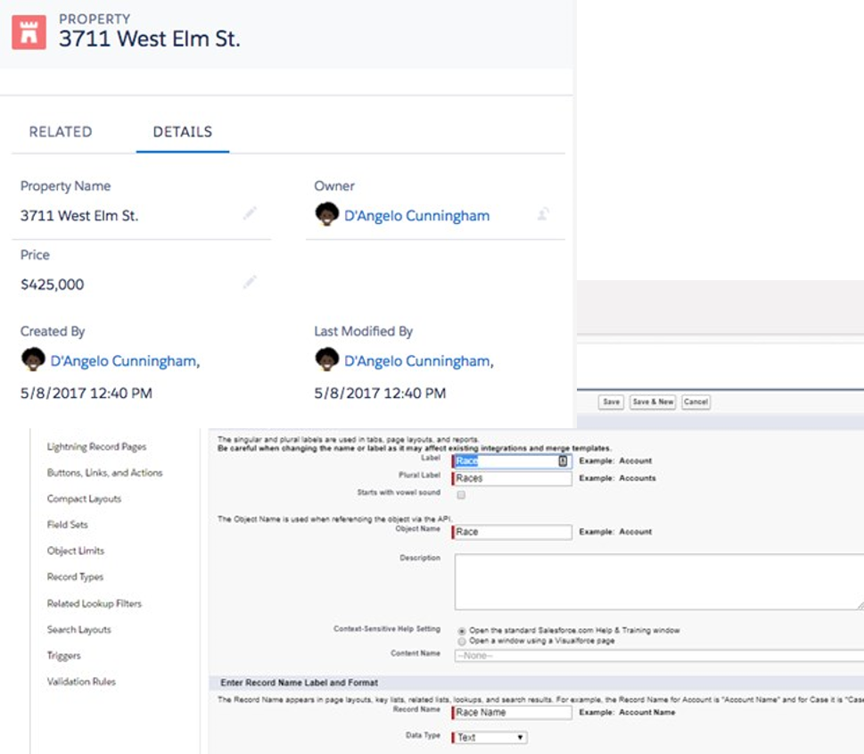

The typical cycle to create new custom objects is -

1. Evaluate the use case / requirement. Identify the need for a new object
1. Design entity / fields / relationship with other entities
1. Design security rules - who will see and update data stored using the said entity
1. Design efficient ways of working with this entity - including UI, automation and validation rules
1. Create stuff as part of a project - in your development environment
1. Deploy the changes for testing. Test and fix things that may not be working as expected
1. Deploy changes to production as part of the project roll-out

The starting point to develop the new entity starts from custom object. To create a custom object -

1. Go to **Setup** > Click on **Object Manager** tab
1. Click on **Create** button dropdown > Select **Custom Object**
1. Select "stuff" from the wizard - most of the items are self-explanatory. Hit "Help" if you want to lean more.
1. Finally, click **Save** to create the object

### Limits

Custom objects are not infinite - as is anything on this planet. Remember that Salesforce is a shared ecosystem and, even with all good intentions, Salesforce cannot provide anyone infinite resources.

The following limits are applicable for custom objects-

| Edition                 | # Custom Objects |
| ----------------------- | ---------------- |
| Contact Manager         | 5                |
| Group, Professional     | 50               |
| Enterprise              | 200              |
| Unlimited & Performance | 2000             |
| Developer               | 400              |

Additional objects can be installed by managed packages, and you could request relaxing the limits - to an extent. There is a hard limit of 3000 objects per org.

See [salesforce limits page](https://help.salesforce.com/articleView?id=overview_limits_general.htm&type=0) for the latest numbers.

## Object Relationships

As the old jungle saying goes -

> No object is an island

So then, we have relationships between objects.

As in the real real-world, relationships can be complex and simple at the same time. In other words, they can be one of one to one, one to many, many to many and many to one. We will look at each of these next.

### Lookup

Lookup relationships -

- Can be 1:1, M:1
- Bind one object so that it can be “looked up” from another
- Relationships can change – reparenting possible
- Child does not inherit security, is independent

For e.g. an account can have zero or more contacts, an account can have zero or more attachments.

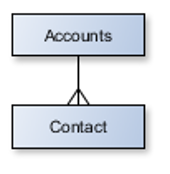

You can create lookup relationships on standard or custom objects -

1. start creating a new field
1. specify the type of relationship
1. specify the target object

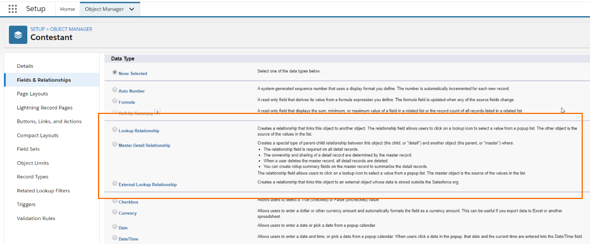

### Master Detail

Master detail relationships -

- Can be 1:M relationship. Have one object as master and another detail (surprise!?)
- In a 1:M relationship - the 'child' record cannot exist 'without' parent
- Child record inherits security rules from parent

For example, a contact can have more than one activities.

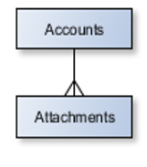

You create master-detail relationships very much like lookup relationship and start creating the new field to specify the relationship.

There are a couple of interesting things about master detail relationships -

1. Roll-up summary fields work on master-detail. So, just with an additional field on master object and without doing anything else - you can get the sum of a field in the child object, or count of child records
1. Standard objects cannot be on the 'child' side of master-detail relationships. They make good parents though (supposedly)

### Other Considerations

There are few other interesting ways in which objects can relate to others. We simply cobbled them under one heading since we are lazy.

You can have interesting relationships between objects including -

1. M:M relationship - by having a intermediary object (called 'junction' object in between the parent and child relationship)
1. Specialised relationships like self (account is related to parent account), and hierarchical (the name says it all - only possible with User object)
1. External lookup and Indirect lookup - relate object that represent integrated data structures with salesforce objects. For e.g. relate SAP Orders object (which can have data coming over from SAP through Salesforce provided / custom means ) to Salesforce Accounts

### Schema Builder

While we are talking about relationships, you would also want to know about this really cool tool called 'schema builder'. It provides -

1. Easy visualisation of object relationships
1. Create objects, fields and relationships in context of the relationship diagram (well, it shows the same screens for creating fields, but may greatly help visual designers!)

Go to **Setup** > **Objects and Fields** > **Schema Builder**

> Side note: While we say "go to _so_and_so_ item in 'Setup'" - it typically does not work that way. Just go to 'Setup' and use the search box located at the top to find the specific setup item. For e.g. just type in 'Schema Builder' in the setup find box.

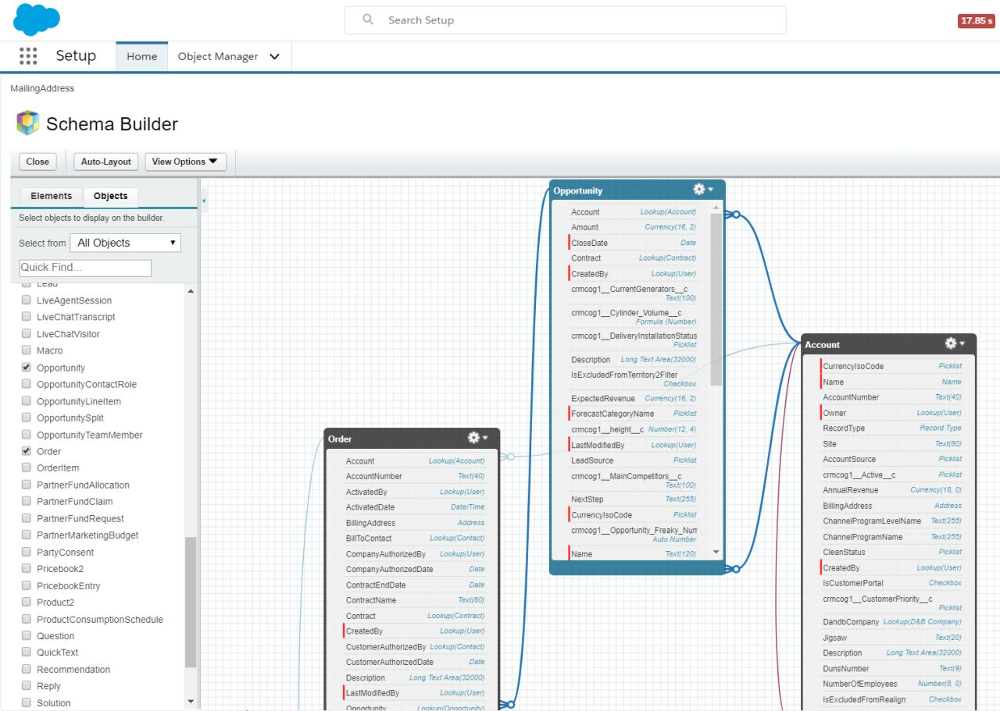

We will get back to relationships while doing a further deep-dive.

## Fields

Objects in Salesforce have their own properties. These may be -

1. Validation rules defined for the object
1. Fields : fields to store data, calculated fields
1. Relationships
1. Pages and layouts that define how object data is displayed on user interface

Now that we have seen something of objects and fields that define relationships, you might have already taken a look at other types of fields that you can create against an object. But, let's do that again together - we simply don't like people to get smart too quickly.

Fields of an object are just attributes of the entity.

For e.g., account can have attributes like Name, Location, Address, Total Revenue, etc., each of which are fields in Account object. Salesforce provides its own, rich typing for its fields – thanks to its abstraction of the data layer.

You would have seen the type of fields in full glory while trying to create a field for relationships.

| Type                  | Can Contain                     | Description                                                  |
| --------------------- | ------------------------------- | ------------------------------------------------------------ |
| Text                  | Letters, numbers, symbols       | Max 255 char.                                                |
| Number                | Integers and decimals           | Significant digits specified in definition.                  |
|                       |                                 | Rounds off to higher number in case of "tie"                 |
| Date, Date-time, Time | Valid date or time              | Enables easier date calculations                             |
| Currency              | Valid currency                  | Uses even number tie breaking rule                           |
| Checkbox              | Boolean                         |                                                              |
| Formula               | Calculations                    | Math functions, System references, lookup field values, etc. |
| Master-detail, Lookup | Relationships to other entities | Field specified during configuration                         |
| Picklist              | Drop-down list                  | Use hard-coded values or global picklist                     |

Some interesting points -

- Standard fields, i.e. , fields supplied by salesforce, cannot be changed. Add custom fields to std. or custom objects
- Design before you develop. Establish relationships and foreign keys/external ids
- Field types can be changed after the field is created (with or without data) - but not in every case. Pick right type for your fields (yes, we don't do that often)
- Be aware of filter & sort needs while choosing the type. Alphabetical sorting puts an account with account number '100' ahead of '20'
- Be aware of limits – rich text, number of fields etc.
- Encryption of data is supported on only specific field types

See more of this on the [Salesforce help page for fields](https://help.salesforce.com/articleView?id=custom_field_types.htm&language=en&type=5).

To create fields -

1. Navigate to **Setup** > Click on **Object Manager** tab
1. Find the standard or custom object for which you want to create fields. Drilldown on the object
1. Click on **Fields and Relationships** tab at the left
1. Click **New**
1. Select type of field, field label
1. Select which user types will have access to the field - to view/edit (see 'field level security' section below)
1. Select to which layouts this field needs to be added (layouts are part of UI discussion - they just provide different user interfaces to different types of users)
1. Click on **Save** button and you are done - congratulations on the new field

Fields can be added to a page layouts (edit/view record) or to a search layout (well, used for searching records) at a later time as well.

This is a simple yet common way of creating new fields. You can also use Salesforce CLI and your favourite editor to create fields and many more supported configuration.

## Data Security - Part Deux

Now that we know more about objects and fields, it is time to see bit more on securing data.

### Field Level Security

Field-level security enables controlling visibility at business layer level -

- view fields (and therefore the values in them)
- edit fields

You assign permission sets or profiles to secure fields.

To set field level security -

1. Go to **Setup** > **Object Manager** tab
1. Drilldown on an object
1. Select **Fields** > Click on button 'Set Field Level Security'.

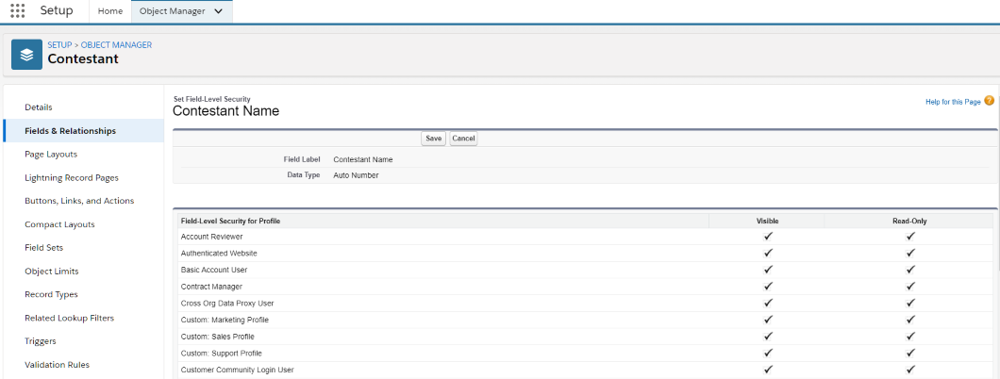

You can check access to different profiles/permission sets by -

1. Go to **Setup** > **Object Manager** > **Fields**
1. Click on button 'View Field Accessibility'.

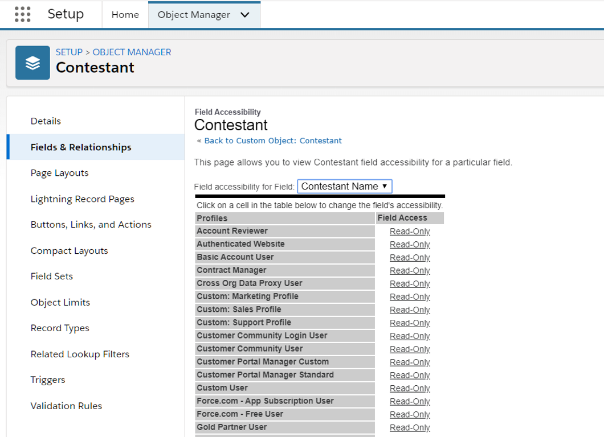

You can also set field level security through the profile / permission set screen.

The permissions set at business layer are applicable to all aspects of the application - may it be UI, reports, data coming through API calls from external applications, or anywhere else. Security rules here override everything else.

But do note some quirks -

1. Roll-up summary or formula fields can reference other fields. Users can gain access to the calculated fields despite not having access to source fields. In fact, this is one of the ways of presenting the protected information in raw or processed form to users who generally do not have access to the said fields
1. You cannot set 'Edit' permissions to system fields or to calculated fields like roll-up summary fields
1. Profiles and permission sets respect data access rules (through roles/sharing rules) unless you have set 'View All' or 'Modify All' permissions

### Record-level Security

In the previous chapter, we have already seen how role-based security plays a big part in what data the user sees based on her role.

In addition, also note that dynamic filters may be applied based on data values in a record. You can configure these filtering rules in couple of ways:

1. Set record types (for e.g. an account's type) and change layouts based on record types. The UI then depends on the record type and user's permission to see a particular layout (see UI security section below)
1. Enable ad-hoc and dynamic sharing of data by users or through logic (using Apex for example)

### Security in object relationships

Two objects may have distinct / contradictory security rules and be related. The security rules for showing related data are applied in context of parent as applicable.

- A lookup field shows up depending on the field level security + UI security rules - even though the user may not have access to the related record
- In case of a master detail relationship: detail record inherits the sharing settings (record level security rules) of the parent, and will be visible whenever the parent is visible. However, they can control field level security (e.g. what is displayed and updateable on the layout ) independently

## Revisiting User Interface

All this talk about object layer is up in the air until this thing called "user interface" (UI) enters the chat.

UI is where all the magic happens as far as the user is concerned. We have seen what exactly UI in salesforce looks like and its components in the previous chapter. It is time to drill-down further.

As we have seen earlier, UI has these layers-

1. Apps and tabs
1. Detail or list views
1. Individual UI elements like buttons, fields etc.

Salesforce provides apps, screens and views for the objects supplied as part of the product. You can modify them or create new elements on your own.

For the record, Salesforce has two distinct types of UI -

1. Classic: This is the salesforce of yore. We may have these in old orgs that find it difficult to migrate to the new UI (was born in 2014, so not quite new at this time)
1. Lightning: This is the default behaviour for all new orgs. Almost all orgs would have some or the other component of Lightning

We almost never deal with Classic. But you have to know a couple of things -

1. Visualforce technology was built to create custom UI in classic Salesforce. It continues to exist and can also support Lightning UI
1. Modern salesforce UI will be developed only using Lightning framework

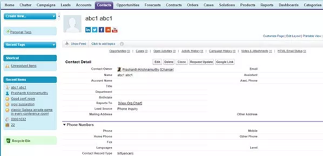

Lightning is the modern avatar of Salesforce UI. Lightning allows you to -

1. Use modern web standards to develop components and assemble them to create powerful UI
1. Create delightful user experiences based on user roles and responsibilities

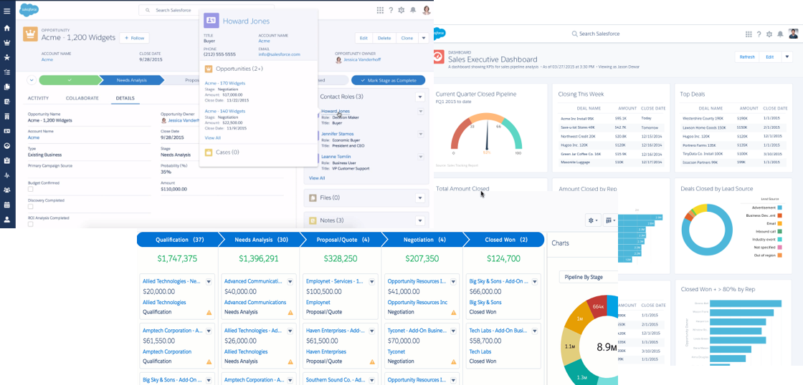

Couple of terminologies to note -

- Lightning UI is the modern UI experience
- Lightning components are the individual UI components built by Salesforce, third parties, or our own development team.
- Lightning framework is used by developers to create custom lightning components

Lightning components come together to form Lightning pages, which in turn are exposed within our beloved tabs.

We can configure different pages using Lightning UI using App Builder -

Go to **Setup** > **User Interface** > **Lightning App Builder**. Click 'New' to be presented with options to create one of three pages -

- app page: created for an app :)
- home page: create one or more home pages for different profiles/permission sets in the same app
- record page: create record detail page that shows records, any visualisations and related records

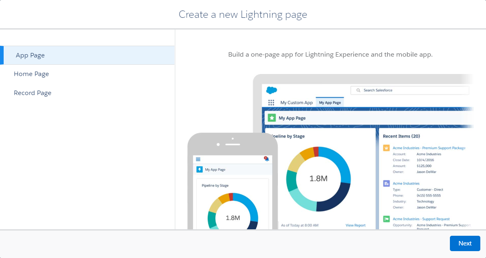

With Lightning app builder, you can -

- Drag and drop components to create a page
- Use different layouts
- Reuse the page in multiple tabs

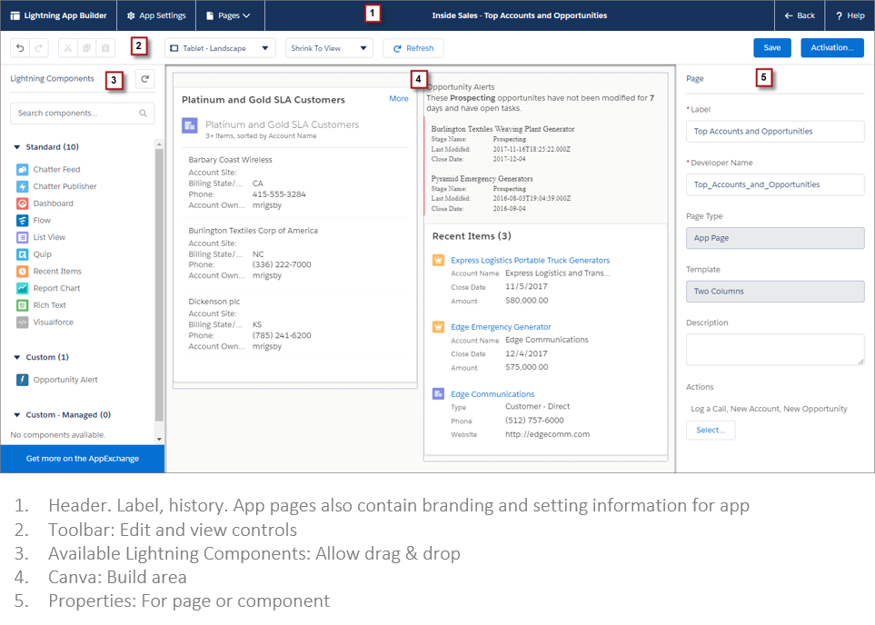

### UI Layer Security

As we have seen earlier -

1. Profiles control which views user has access to
1. Roles control the data

Now, we will change the first statement to "profiles control which UI user has access to". You control the access to UI fields by creating layouts for a page and assigning layouts to different profiles.

So..

1. You create/modify layouts (out of box layouts are read-only and can only be cloned)
1. You can make fields visible (or read-only) on specific layouts of account page
1. Assign those layouts to distinct profiles - e.g. sales rep layout and sales manager layout

.. and you are done.

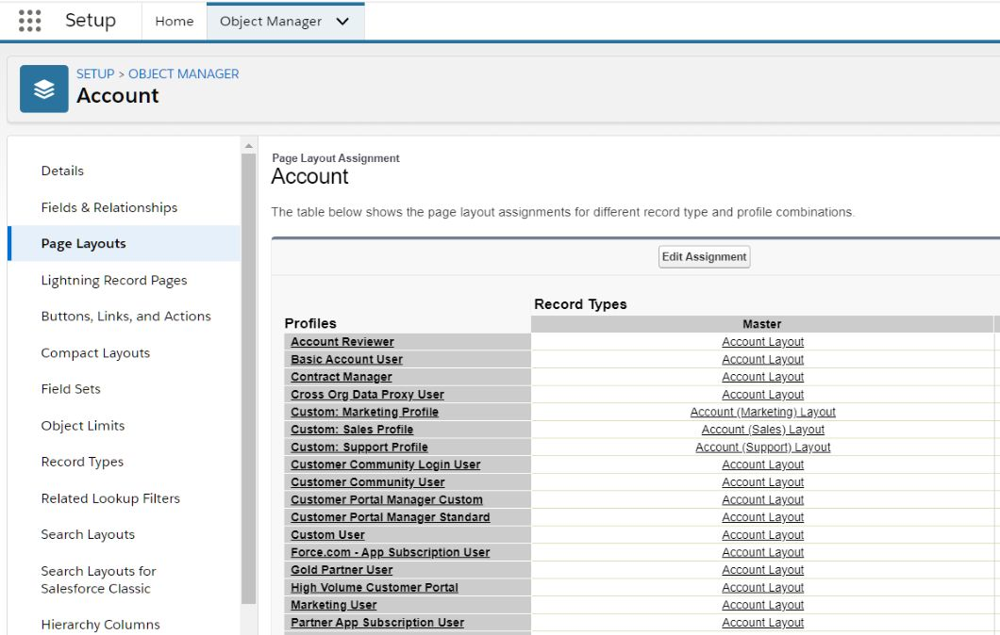

But, where do these layouts fit in?

You do remember that we previously said that you include components in the Lightning Page builder to create pages? You can include detail views in those pages, and those views automatically show the layouts based on user's profile.

If that's not cool, we don't know what is.

A few more interesting points -

1. You not only make fields visible on a layout, but can also make those fields read-only
1. Business layer (i.e., object and field-level) rules will override any UI level rules. For e.g. if a field is read only at the object level, it cannot be made read-write at the UI layer. UI can only add restrictions on top of whatever exists at the business object layer
1. There are interesting combinations to be had with UI layouts and read-only behaviour - these can also be driven by data. For e.g. accounts with status 'Approved' can have certain fields read-only to most users. All these rules come together to apply the most restrictive policy for a user.

## Workshop

Activities in this section will overlap with subsequent lessons. Plan to discuss with instructor and complete them as early as humanly possible.

| No. | Type    | Description                                                                | Time (hrs) |
| --- | ------- | -------------------------------------------------------------------------- | ---------- |
| 1   | Read    | Case study overview and map objects                                        | 0.5        |
| 2   | Do      | Create relationship diagram, provide attributes and discuss                | 2          |
| 3   | Do      | Create roles and profiles/permission sets                                  | 1.5        |
| 4   | Present | Discuss objects, relationships and roles                                   | 2          |
| 5   | Do      | Create basic apps, objects and views                                       | 2.5        |
| 6   | Do      | Create dummy users with different roles – doctors, CC, nursing, admin, CxO | 0.5        |
| 7   | Do      | Setup data – facilities, patients, care. Test data access rules            | 2          |
| 8   | Do      | Setup activity types                                                       | 1          |
| 9   | Do      | Cross check fields & attributes with indicative list                       | 0.5        |

### Overview

UC Hospitals is a leading hospital chain with branches in Bangalore, Chennai and Mumbai. It specialises in generic treatments, emergency care, corporate medical check-up and treatments. The CEO ‘Rajesh Pradhan’ has recently taken over the reins of the company and has committed to aggressive expansion to heal people everywhere.

UCH has chosen Salesforce as the application for managing their customers, and generic admin work at hospitals. UCH has tasked you and your team to develop a solution on Salesforce.com platform.

#### Facilities

Facilities include –

1. Building: each branch has its own building
2. Ward – Private (1 bed), Semi-private (2 beds), General (6 beds)
3. Staff Room – Doctor, Nursing staff
4. Lab – Blood, Pathology, X-ray

Chennai and Mumbai have one branch each, while Bangalore has 3 branches in North, South, and East. Every branch has 10 private rooms, 15 semi-private rooms and 20 general rooms for patient treatment.

#### Roles

UC Hospitals has the following roles in each of their centres –

1. Doctors
2. Housekeeping – Staff for cleaning, upkeep and maintenance

Following roles are shared within the city –

1. Admin Head
2. Admin Assistant
3. Finance Analyst
4. Sales Reps
5. Sales Manager
6. Nursing /Examination Staff
7. Customer Care Specialists (also known as service reps)
   - Receptionists
   - Facilitators who are affiliated to doctors
8. Service Managers
9. Regional Manager

Sales and CC Reps answer calls related to sales or service when users call the centralised call centre.

Admin Assistants report to Admin Heads in the city, while Admin Head reports to COO. Sales Managers and Service Managers also report to COO. All finance analysts report to CFO. COO and CFO report to CEO.

#### Profiles and Permission Sets

- Admin can view accounts, contacts and edit/view facilities in their own city
- Finance analyst can view facilities, accounts, and contacts
- Sales reps and sales managers can see only accounts, contacts in their own city
- CC can view and edit patient data in their own branch
- CC can view patient data from a different branch, but would need to request access to the service manager to edit patient data
- Housekeeping can view facilities
- Nursing Staff can view patient data from their own branches, and view/edit examinations and treatments
- Doctors can view patients who are affiliated to them, and recommend “examinations” and “treatments”
- CxO can view all data

#### Customers

UCH deals with two major types of customers –

1. Corporates - Large corporates, small to medium sized companies
2. Households – Households that consist of individuals

Patients and contacts are segregated for logistical reasons. Patients are divided into inpatient and outpatients. The storage of data is centralized so that customer care specialists, service & sales specialists can have access to data outside of the branch.

#### Care

Doctors recommend examinations which are recorded in SFDC. Individual facility (e.g. X-Ray) provide examination services based on the recommendation. Nursing care needs to be added automatically per day for inpatients only.
Medicines and further tests may be prescribed to patients. These are recorded within SFDC as well.
Care types done through examinations are already mentioned earlier.

#### Activities

Setup activity/event types/services –

| Role          | Activity Type                                                                   |
| ------------- | ------------------------------------------------------------------------------- |
| House Keeping | Minor Maintenance, Major Maintenance, Repair, Cleaning, Cleaning L, Cleaning XL |
| Doctors       | Record case history and comments                                                |
| Nursing Staff | Record observation – vitals and health data                                     |
| CC            | Log outbound and inbound calls, make appointments, log visits, log feedback     |
| Patient       | Visits, Admission                                                               |

#### Indicative Fields

| Entity    | Fields                                                                                                                     |
| --------- | -------------------------------------------------------------------------------------------------------------------------- |
| Doctor    | Id, First Name, Last Name, Education, Specialisation, Phone Number, Mobile, Email, Patient Id, Available Hours Start / End |
| Patient   | Id, First Name, Last Name, Do not call, Phone Number, Mobile, Email, Home Address, Household, Corporate                    |
| Care      | Type, Service Facility, Medicine Name, External/Internal, Fees                                                             |
| Customers | Type, # Covered, Potential Value, Start Date, End Date, Status, Last Activity Date                                         |

## Teaching Aids

### Presentation

#### 1. Configure Custom Functionality: sf-cog

&nbsp;

<iframe src="https://docs.google.com/presentation/d/e/2PACX-1vRINqBiMv2SE6j8WUDrkDRSO6H7GZm72wp0dC8PE-VRWq3t3hbN5lsweWAYNfIaCQ/embed?start=false&loop=false&delayms=60000" frameborder="0" width="800" height="600" allowfullscreen="true" mozallowfullscreen="true" webkitallowfullscreen="true"></iframe>

[More info](/misc/pricing#sf-cog)
