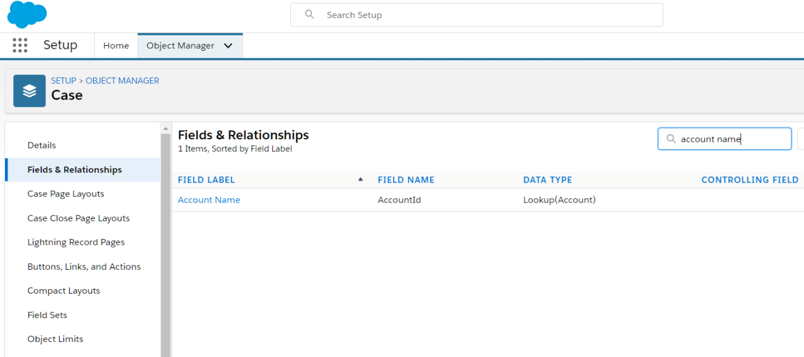
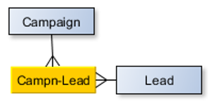
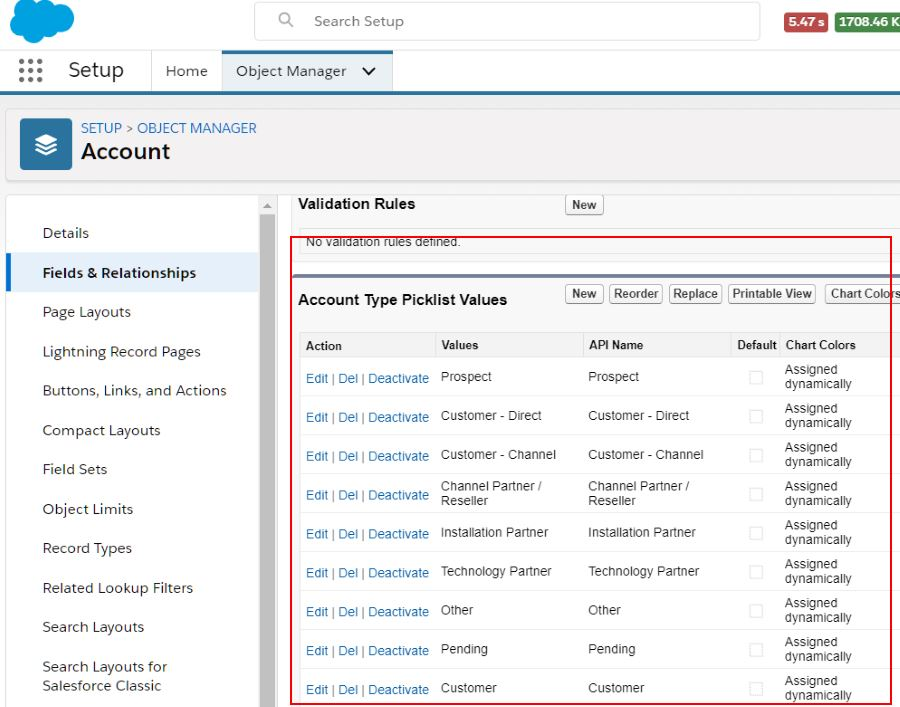

# Deep-dive Business Layer

We will delve a bit more in the business layer configuration in this section. It is time to see how they are developed, some of the limitations, and the things you have to keep in mind while designing relationships.

## Entity Relationships

In a previous chapter we saw the different possible relationships in Salesforce.

As you may have realised by now (or not - depending on your background) Salesforce relationships map back to the database design model. But, they are not the same at many levels – the objects and relationships are abstracted to become more powerful.

While dealing with relationships, get used to parent/child terminologies and where relationships are initiated from. They may be called related objects, master-detail, source / target - does not really matter. The big thing to remember is that you are viewing detail / related records in the context of the parent/source object.

Relationships decide the functionality that can be implemented in parent or child on many levels -

1. Data security rules applicable to the related record
1. Possible functions like roll-up summary on the parent object, or using a formula field to inherit something from parent

Design relationships for scale and performance -

1. Querying on M:M records is no joy
1. Designing something as 1:1 only to be changed to 1:M later is a lot of work
1. You will not be able to leverage salesforce provided functions by going out of the way with your own design - for e.g. not being able to inherit parent ownership rules for the detail record

## Master-Detail Relationship

You link two objects so that one becomes the master (a.k.a parent) in a master-detail relationship.

For example, there is a master-detail relationship on the 'account' object to 'attachments'.

So how about on the 'attachment' side of things? Should it relate back to account? Should it have any particular relationship? Well, the answer is - it really depends. Attachments may or may not independently exist without account. The two relationships may also be independent or not quite independent - they are distinct though.

In Master-Detail relationships -

- Parent controls detail and sub-detail record behaviour
- Deleting parent will delete child
- Detail will inherit and follow master’s visibility/sharing rules

When you are designing the Child record layout, you will see that the Master field is required on record layout.

Unique capabilities to master-detail relationships -

- Roll-up summary fields provided out of box. You can sum a field or provide count of records using a formula field on the parent object
- Administrators can enable reparenting function - you can change parent of a child record. This is useful in certain scenarios like when you are trying to transfer contacts to a new account

Limitations -

- Master detail has tougher limits as compared to other relationships - you can have only 2 master-detail relationships in a custom object.
- You cannot make a salesforce standard object as the detail object in the relationship.
- Not a hard limit but a best practice. Not more than 10,000 detail for per master record - in theory, you may have as many as you want

## Lookup Relationships

Lookup relationships are similar to master-detail relationships in a lot of ways. There can be 1:M or 1:1 relationship between two objects (or object relating to itself - self relationship) linked through a lookup. The looked up object's reference is stored in the source.

For example, Cases have a lookup relationship with Accounts.

A few interesting points about lookups -

- They don't support roll-up
- Related records are not automatically shared (or 'unshared') based on parent
- Deleting fields in a relationship is more tricky. You can choose how system should treat deletes -
  - `Clear the value of this field`: Deleting parent can clear parent from detail
  - `Don't allow deletion of the lookup record that's part of a lookup relationship`: Do not allow deletion of parent if detail is present
  - `Delete this record also`: Delete parent if child is deleted (only for custom objects)
  - `Delete this record also` can result in cascade delete. This has to be turned on by Salesforce (can delete detail records even if users can't see them)
- Detail deletion does not get logged in field history tracking if parent is deleted

## Other Relationships

#### M:M using junction object

M:M relationships in salesforce are a couple of 1:M relationships between the said objects and a third object called 'junction object'. The junction object is a simple object that typically stores ids of related records from two different objects. This is similar to the intersection table concept in relational databases

For e.g. a campaign can have one or more leads. A lead in-turn can be part of more than one campaign.

#### External lookup:

An external object is a Salesforce object representation of data structure that resides outside the org.

For e.g you can relate Salesforce accounts to orders stored in ERP. Then -

- orders are created as external objects within salesforce. It integrates using supported mechanisms to get data from the said external system
- a relationship field is created to relate those external records to account.

External look up fields specify an external object as parent and salesforce object as the child.

#### Indirect lookup

Again relates an external object to salesforce objects - only in this case, external object is child and parent is a custom/standard object.

This kind of relationship uses an unique external id as key.

#### Self relationship

A self-relationship is an object relating to the same object. It is not exactly a distinct type of relationship - it can be either 1:1 or 1:M.

For e.g. an account can have zero or more child accounts.

#### Hierarchical relationship

Hierarchical relationships define cascading relationships between records. In Salesforce it exists only for User object.

## Relationship Quick Reference

Different relationships in Salesforce -

  _src: salesforce.com_

It is also important for you to understand the different possible relationships with 'external' objects.

| External Lookup                                                                            | Indirect Lookup                                                                            |
| ------------------------------------------------------------------------------------------ | ------------------------------------------------------------------------------------------ |
| External object parent -> Custom or standard (or external) object detail                   | Custom or standard parent -> external object detail                                        |
| Use external id field on parent external object mapped to details’ ext. relationship field | Custom, unique external id in parent maps against child indirect lookup relationship field |

## Fields: Picklists

You may have noted in the previous chapter that fields can be of type 'picklists'.

Picklists all you to control what users enter against the field. Instead of typing away to glory, a picklist field presents a set of values that user can choose from (or they can start typing in and receive suggestions).

In practice, you create a picklist field against the object and provide the values.

.. and see it in action on the actual screen.

You may also configure a 'multi-select picklist'. As the name suggests, the user can select more than one value against the field.

Picklists can also depend on each other. For e.g. -

1. The list of valid 'Account Sub Type' values may depend on which 'Account Type' value is selected
1. A 'Case Sub Status' may show only specific values depending on whether 'Case Status' is 'In Progress' or 'Closed'

In dependent picklists -

1. The picklist that depends on another picklist field is called 'dependent picklist'
1. The picklist (or a 'checkbox' which has finite valid values) on which the first field depends on is called 'controlling picklist'

Note that the dependent and controlling picklist values will be for same record.

There are rules that dependent and controlling picklists play by -

- Controlling picklist can be any one of standard picklist, custom picklist, standard or custom checkbox
- Dependent picklist can be one of custom picklist, multi-select picklist

## Workshop

| No. | Type | Description                                    | Time (hrs) |
| --- | ---- | ---------------------------------------------- | ---------- |
| 1   | Do   | Establish entity relationships                 | 2          |
| 2   | Do   | Create validation rules for visits             | 1          |
| 3   | Do   | Create automation for visits                   | 3          |
| 4   | Do   | Create formula fields / roll-up summary fields | 1          |

### Establish entity relationships

- Establish relationships between different entities as described in the discussed ERD – Hospital, Facility, Doctor, Patient, Care, Customers and Contacts

### Create validation rules for visits

1. Visit start date should not be earlier than the previous day
2. Visits must have one or more doctors in active status associated
3. Allow not more than 3 visits to be scheduled by the same patient
4. Allow not more than 10 visits / hour of doctor availability

### Create automation for visits

1. Visits should be cancelled with reason code as “No Show” if there is no visit on the scheduled time (only for scheduled visits)
2. Allow CC to “check-in” scheduled visits
3. Send reminder for scheduled visits one day prior to the visit
4. Closure of visits should result in a ‘thank you’ email sent to patient
5. Summarize visits for each day against doctors and send automated email to doctors

### Create formula fields / roll-up summary fields

1. Show the last ‘no show’ date when patient calls up for an appointment
2. Create formula field to sum up total fees for today against doctors
3. Roll up fees for individual items against the visit

## Teaching Aids

### Presentation

#### 1. Deep-dive Business Layer: sf-cog

&nbsp;

<iframe src="https://docs.google.com/presentation/d/e/2PACX-1vRPWN3rYRf_a_6GGDWOFAn_6nyt9fBcnKvjgXAotDa1KZbERRC_WbCNLetHQOQ4qw/embed?start=false&loop=false&delayms=60000" frameborder="0" width="800" height="600" allowfullscreen="true" mozallowfullscreen="true" webkitallowfullscreen="true"></iframe>

[More info](/misc/pricing#sf-cog)
