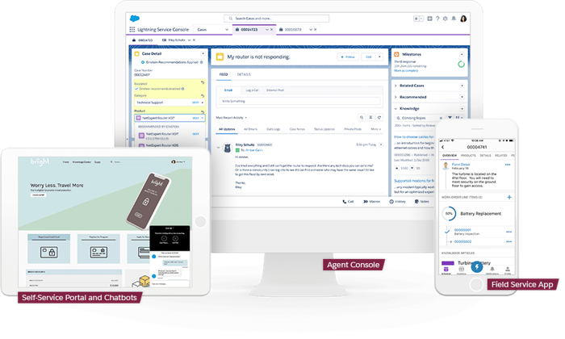
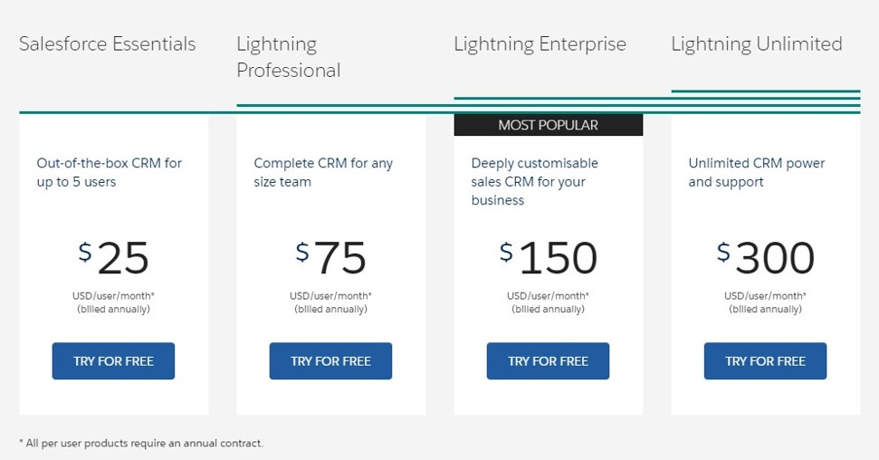
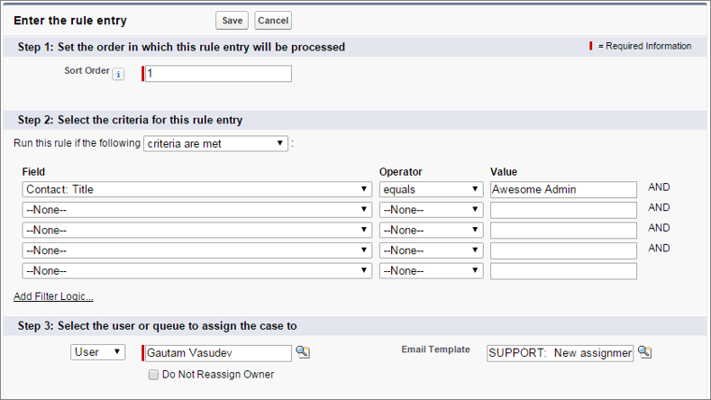

# Service Cloud

Salesforce groups functions related to service organisations in 'service cloud' product. Service cloud consists of apps, objects/rules/automation and more to increase service efficiencies of an organisation -

- Enables reps to manage service business
  - Provides tools to know your customer and issues
  - Faster case resolution
  - Multi-channel platform for org employees, partners and customers
- Pinnacle of transactional service offering
- Service takes over from sales, and works together with other enterprise systems for - fulfilment
- Focused on service management

Similar to Sales Cloud, Service Cloud enables different levels of functionalities in different editions.

  _src: [Service Cloud Pricing](https://www.salesforce.com/in/products/service-cloud/pricing/)_

## Who uses Service Cloud?

- Service Cloud is used by Service Professionals
  - Capture complaints, feedback and customer conversations
  - Process cases for resolution
  - Support customers across channels
- Service Operations
  - Align processes to improve productivity and optimise service
  - Improve service rep efficiencies
  - Optimise service times, and part supply chain
  - Service scheduling
- Field Service
  - Offer right service onsite

## Processes

The typical processes associated with sales cloud are -

- Case management
- Task management
- Service order management
- Knowledge management

## Entities

Typical entities in service cloud -

| Entity                        | Description                                                                                                                 | Attributes                                    |
| ----------------------------- | --------------------------------------------------------------------------------------------------------------------------- | --------------------------------------------- |
| Case                          | Inquiries, feedback, service request, complaints                                                                            | Number, Type, Priority, Escalation, Status    |
| Contacts & Accounts           | Individuals and businesses who are of interest to the organization                                                          | Name, Phone, Address, Category                |
| Knowledge                     | Collated knowledge articles to resolve issues or respond to customer. Well integrated in the service flow and has analytics | Title, Description, Types, Categories, Voting |
| Solution                      | Documented solutions to address cases                                                                                       | Title, Description, Status                    |
| Community                     | Users and interest group.                                                                                                   |                                               |
| Live Agent / Mobile Messaging | Communication channels to engage customers                                                                                  |                                               |
| Social                        | Engage customers on social media                                                                                            |                                               |

## Cases

## Business Automation for Cases

### Assignment Rules

Assignment rules enable businesses to identify right owner for given case, and route cases without (or with minimal) intervention. Using these rules an administrator can have the system assign cases (new/cases not attended to/anything else) to specific groups (typically to "queues") or individuals depending on a set of rules.

### Auto-response Rules

Use auto-response rules to send acknowledgement, response, update emails without human intervention.

Salesforce enable administrators to -

- create templates for sending notifications by dynamically include relevant data (E.g. case number) in acknowledgement/response
- send emails through specific templates when cases satisfy conditions set forth in rules
- send emails to specific personnel based on their privileges and relevance. Copy support personnel in response emails

### Escalation Rules

Salesforce enables administrators and service leaders to create rules that redirect cases when not attended to (or when they meet select criteria) and provide attention to cases not being actively worked upon.

Using escalation rules you can-

- Define SLA response/resolution times for Cases – order, criteria
- Escalate cases to queue or individuals
- Define specific notification and escalation actions to automate sending emails, creating tasks and more

### Email to Case

## Tasks

## Orders

## Knowledge / Solution

## Service Console

## Communities

## Live Agent

## Workshop

| No. | Type | Description                       | Time (hrs) |
| --- | ---- | --------------------------------- | ---------- |
| 1   | Do   | Explore cases                     | 0.5        |
| 2   | Do   | Create assignment rules for cases | 0.5        |
| 3   | Do   | Create auto-response rules        | 0.5        |
| 4   | Do   | Create escalation rules           | 0.5        |
| 5   | Do   | Enable email to case              | 0.5        |

### Explore cases

- Explore service console and “normal” UI
- Create solutions/knowledge and associate against case

### Create assignment rules for Cases

1. Create automation –
   - If customer is Corporate, any patient is associated with customer – assign account owner as a ‘Hospital POC’ against visit record
   - Assign any cases created by corporate patients to account owner

### Create auto-response rules

1. Create auto-response rules to trigger when case is created
   - Email details of case to patient
   - Copy email to Account Manager if patient is a corporate customer
2. When case gets resolved, send notification –
   - If query – we hope the query was addressed to satisfaction. Else connect with us to help you better
   - If complaint – complaint stands resolved. Please get in touch with Service manager if not satisfied

### Create escalation rules

1. Escalate to Service Manager if any case is not resolved in 5 days
2. Escalate to Service Manager if cases from corporate customers are not resolved in 2 days

### Enable email to case actions

1. Create email to case function

## Teaching Aids

### Presentation

#### 1. Service Cloud: sf-cog

&nbsp;

<iframe src="https://docs.google.com/presentation/d/e/2PACX-1vRAOEcIF_w24QtGH5NIV1HyejOYw9HqVPtPyb0WKHj-802wc3pguvpDY-TD2AdMUQ/embed?start=false&loop=false&delayms=60000" frameborder="0" width="800" height="600" allowfullscreen="true" mozallowfullscreen="true" webkitallowfullscreen="true"></iframe>

[More info](/misc/pricing#sf-cog)
